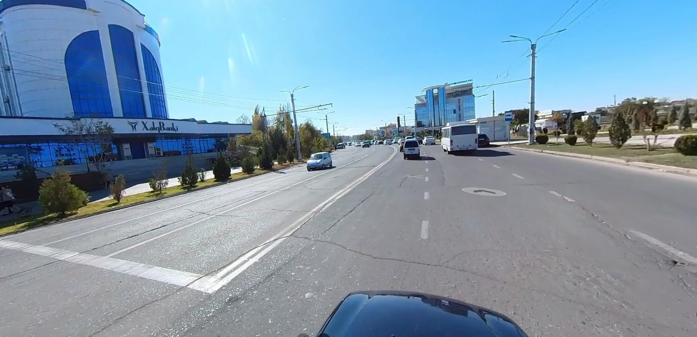
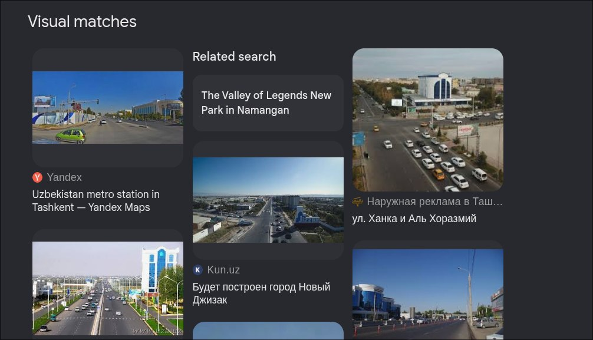
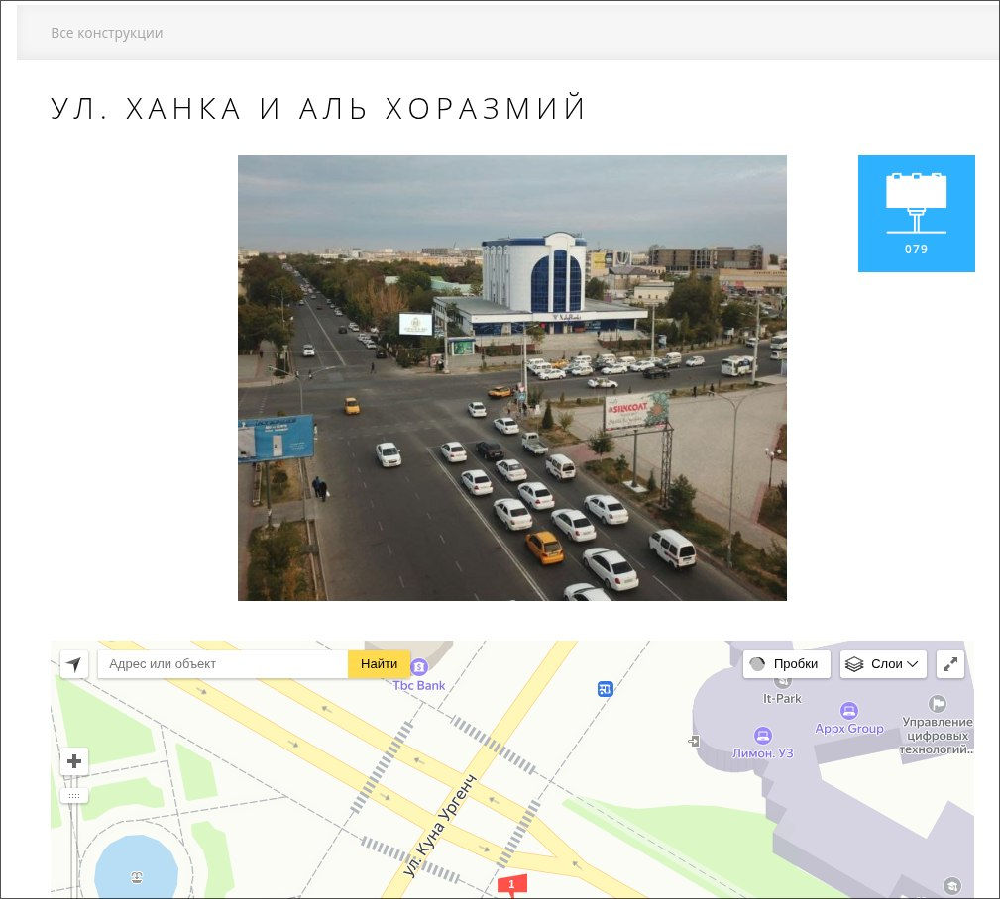
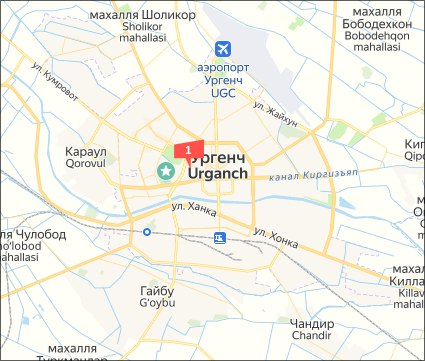
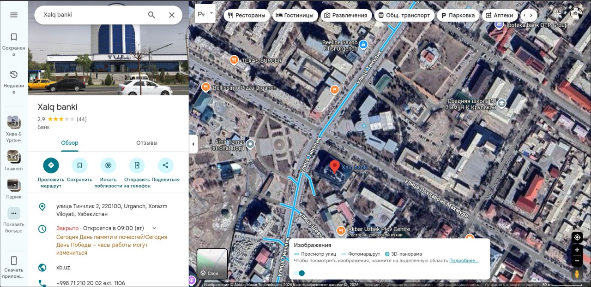
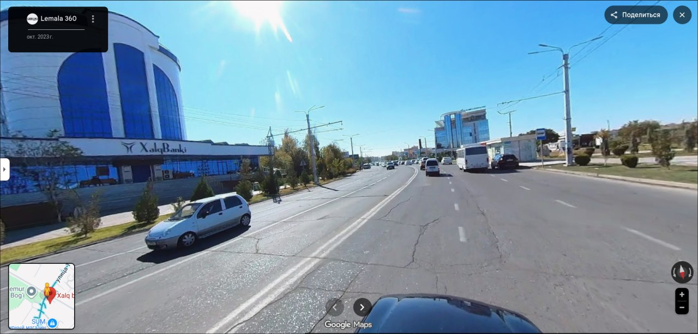
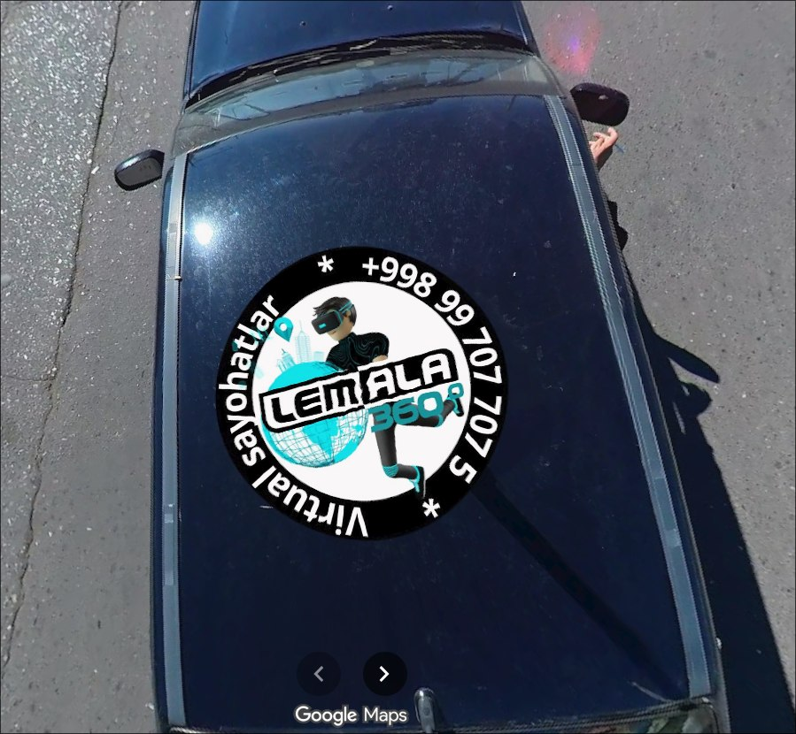

# HackNowUZ: Google Street View

## Category
OSINT

## Difficulty
Easy

---

## Description

The image provided was taken via Google Maps. It depicts one of the city's central streets, with the Xalq Bank building located on the left side. A car passing through this street was captured by the Google Street View service.

Your task is to identify the phone number written on top of that car.

Flag format: HackNow {+99899_777_77_77}



---

## Solution

### 1. Metadata Analysis

The investigation began with an analysis of the image's metadata (EXIF data). Using exif.tools, I examined the PNG file. The metadata revealed that the image was a screenshot captured using ```gnome-screenshot``` on August 21, 2025. No GPS coordinates or hidden steganographic tags were present, confirming that the solution relied entirely on external OSINT techniques.

### 2. Reverse Image Search

I uploaded the original image to Google Lens/Search by Image. The search indexed a specific entry on ```outdoor.uz```, a catalog for outdoor advertising. This result provided the crucial breakthrough: the city was identified as Urgench, Uzbekistan.







### 3. Geographic Mapping

With the city identified, I navigated to Google Maps and searched for ```Urgench Xalq Banki```. This led to the exact branch location on one of the city's main arterial roads.



### 4. Google Street View Exploration

I dropped the "Pegman" icon onto the street adjacent to the bank. By navigating a few meters along the timeline and adjusting the camera angle, I located the exact frame where the vehicle mentioned in the task was visible.



### 5. Extracting the Flag

By zooming in on the vehicle's exterior (which featured promotional decals), the phone number became clearly legible. Following the competition's format, this number served as the final flag.



## Flag
---

HackNow {+99899_707_707_75}

---

# Tools Used
1. exif.tools
2. Google Lens
3. Google Maps / Street View

---
