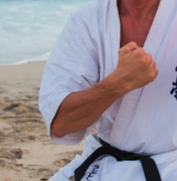
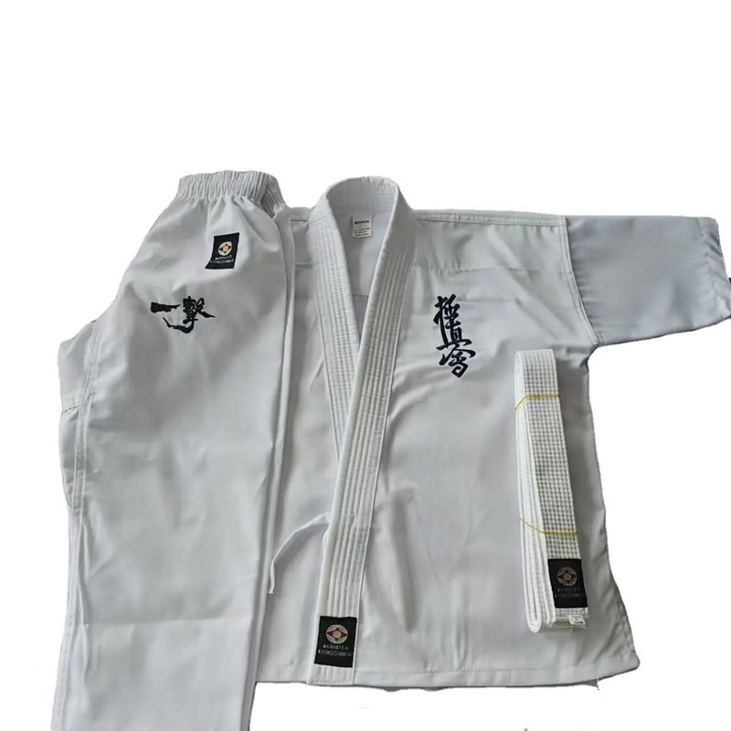
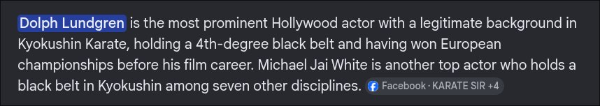
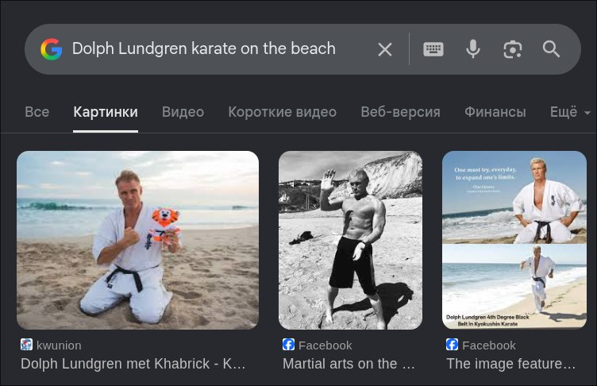
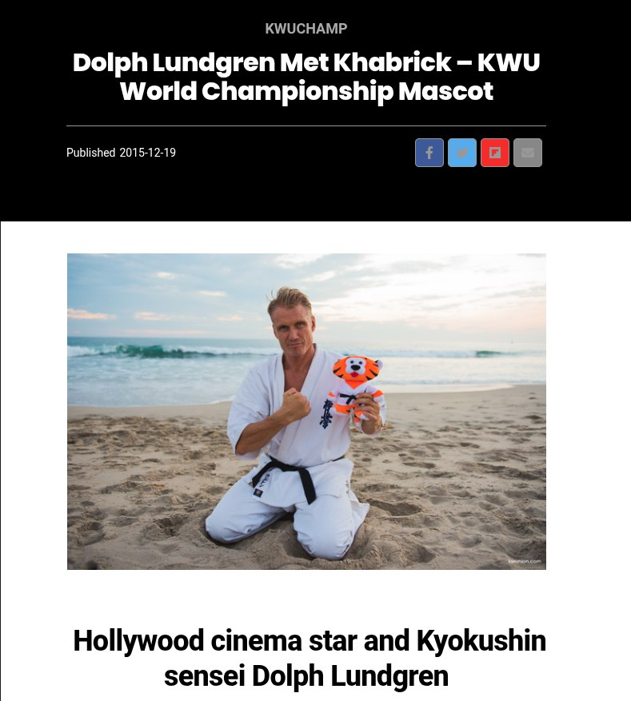

# [HackNow]: [Hollywood aktyori]

## Category
OSINT

## Difficulty
Medium

---

## Description

You are given a photo of a famous person's (Hollywood actor) right hand. Identify the name of the object held in this person's left hand.



---

## Solution

### 1. Visual Analysis and Initial Search

The process began by analyzing the clothing in the provided image. Using Google Lens on the uniform's patches and embroidery, the attire was identified as a ```Kyokushin Karate gi (dogi)```.



### 2. Identifying the Actor

To narrow down the individual, a targeted Google search was performed: "top hollywood actor martial arts Kyokushin Karate". This led to ```Dolph Lundgren```, who is a well-known 3rd-dan black belt in Kyokushin.



### 3. Contextual Image Retrieval

Using the actor's identity and the background of the original image, a more specific search was conducted: "Dolph Lundgren karate on the beach". This search successfully retrieved the full, uncropped photograph.



### 4. Object Identification

The full image reveals Lundgren holding a plush tiger. Further research into the event context (promotional photos for karate championships) confirmed that this is Khabrick, the official mascot of the ```KWU (Kyokushin World Union) World Championship```.



### 5. Flag Formation

Following the challenge instructions to name the object held in the left hand, the name "Khabrick" was used to complete the flag format.

## Flag
---

HackNow{Khabrick}

---

# Tools Used
1. Google Lens (Visual Recognition)
2. Google Search (Advanced Dorking)
3. Image Reverse Search (Source Verification)
4. OSINT Research (Entity Identification)

---
